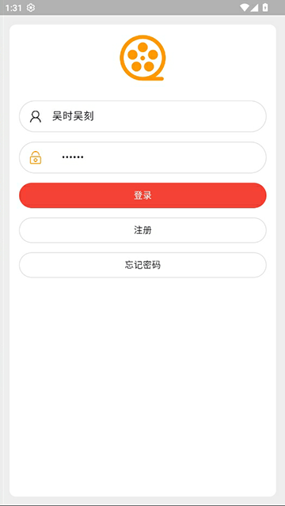
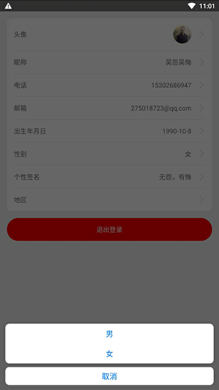

# flutter电影APP

开发者：吴怨吴悔

=============================界面预览（如果无法预览，请查看项目根目录png文件）==========================

=============================界面预览（如果无法预览，请查看项目根目录png文件）==========================

flutter版本：3.2.22

dart版本：3.4.3

项目系2020年开始搭建，从flutter2.0.2升级到3.2.22 

运行命令：flutter run

后端接口使用springboot开发，所有电影数据来自于python爬虫程序，爬取第三方电影网站数据

## 使用的插件

轮播：flutter_swiper: ^1.0.2   

网络请求：dio: ^5.8.0+1   

路由：fluro: ^2.0.5    

屏幕相关：flutter_screenutil: ^5.9.3   

状态管理器: provider: ^6.1.2	 

下拉加载：flutter_easyrefresh: ^2.2.2   

提示组件fluttertoast: ^8.2.10   

缓存：shared_preferences: ^2.3.3   

webview：webview_flutter: ^4.8.0   

路由：fluro: ^2.0.5   

app功能

​	●获取缓存用户数据

​	●获取token

​	●自动登录

​	●状态管理器provider

​	●底部导航栏

​	●头像

​	●电影搜索

​	●banner轮播

​	●滚动加载分类电影

​	●电影详情页

​	●电影推荐

​	●电影评分

​	●电影收藏

​	●电影评论

​	●电影播放器

​	●电影播放地址切换

​	●电影播放记录

​	●电影浏览记录

​	●电影收藏记录

​	●用户使用情况

​	●电影剧情

​	●电影演员

​	●注册

​	●登录

​	●找回密码

​	●修改密码

​	●退出登录

​	●相机

​	●相册

​	●修改用户信息

​	......

后端接口项目和sql语句：   
https://github.com/wuyuanwuhui99/springboot-app-service   
https://gitee.com/wuyuanwuhui99/springboot-app-service   

flutter版本参见:   
github地址：https://github.com/wuyuanwuhui99/flutter-movie-app-ui   
gitee地址：https://gitee.com/wuyuanwuhui99/flutter-movie-app-ui

flutter音乐项目参见:   
github地址：https://github.com/wuyuanwuhui99/flutter-music-app-ui   
gitee地址：https://gitee.com/wuyuanwuhui99/flutter-music-app-ui

react native版本参见:   
github地址：https://github.com/wuyuanwuhui99/react-native-app-ui

java安卓原生版本参见：  
通用地址：https://github.com/wuyuanwuhui99/android-java-movie-app-ui   
gitee地址：https://gitee.com/wuyuanwuhui99/android-java-movie-app-ui

uniapp版本参见：
github地址：https://github.com/wuyuanwuhui99/uniapp-vite-vue3-ts-movie-app-ui   
gitee地址：https://gitee.com/wuyuanwuhui99/uniapp-vite-vue3-ts-movie-app-ui

uniapp音乐项目参见：
github地址：https://github.com/wuyuanwuhui99/uniapp-vite-vue3-ts-music-app-ui   
gitee地址：https://gitee.com/wuyuanwuhui99/uniapp-vite-vue3-ts-music-app-ui

微信小程序版本参见：  
github地址：https://github.com/wuyuanwuhui99/weixin-movie-app-ui、

harmony鸿蒙版本参见:   
github地址：https://github.com/wuyuanwuhui99/Harmony_movie_app_ui   
gitee地址：https://gitee.com/wuyuanwuhui99/Harmony_movie_app_ui

harmony鸿蒙音乐项目参见:   
github地址：https://github.com/wuyuanwuhui99/harmony_music_app_ui   
gitee地址：https://gitee.com/wuyuanwuhui99/harmony_music_app_ui

vue在线音乐项目：  
github地址：https://github.com/wuyuanwuhui99/vue-music-app-ui

在线音乐后端项目：  
github地址：https://github.com/wuyuanwuhui99/koa2-music-app-service

vue3+ts明日头条项目：  
github地址：https://github.com/wuyuanwuhui99/vue3-ts-toutiao-app-ui

使用token做登录验证，/service/movie/接口不需要验证，/service/movie-getway/接口需要token验证   

乐播放器正在开发中，音乐数据来自于python爬虫程序，爬取酷狗音乐数据，敬请关注   

接口和数据请在本地电脑中，暂时没有购买和部署服务器，仅限本地调试，如有需要调试请联系本人启动外网映射   

本地调试请把 http://192.168.0.5:5001 改成 http://254a2y1767.qicp.vip    
该地址是映射到本人电脑的地址，需要本人电脑开机才能访问，一般在工作日晚上八点半之后或者周末白天会开机   
如需了解是否已开机，请用浏览器直接打开该地址：http://254a2y1767.qicp.vip，如出现以下提示，则正常使用   

本站所有视频和图片均来自互联网收集而来，版权归原创者所有，本网站只提供web页面服务，并不提供资源存储，也不参与录制、上传 若本站收录的节目无意侵犯了贵司版权，请联系   

联系方式：（微信）wuwenqiang_99、（邮箱）275018723@qq.com
