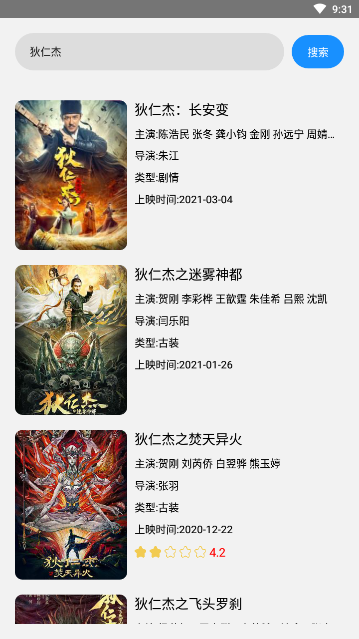
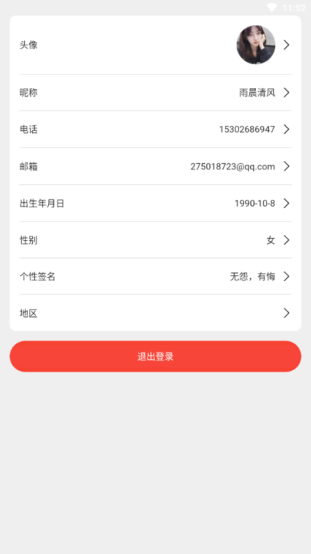
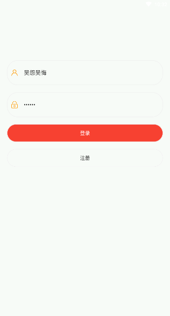
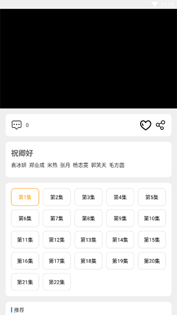
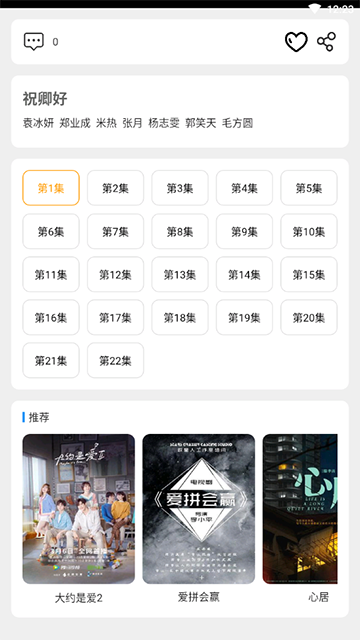
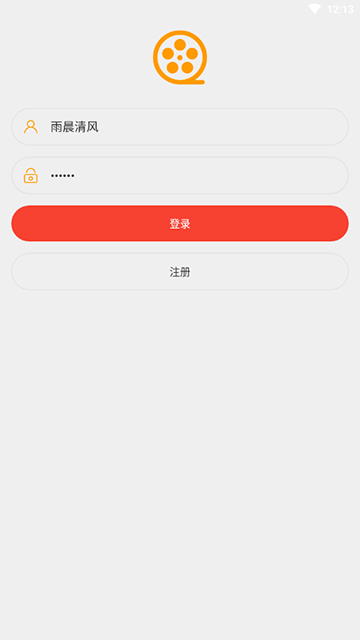
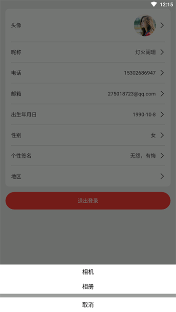

# flutter电影APP

开发者：吴怨吴悔

=============================界面预览（如果无法预览，请查看项目根目录png文件）==========================

=============================新版==========================

=============================界面预览（如果无法预览，请查看项目根目录png文件）==========================

flutter版本：2.0.2

dart版本：2.12.1

项目系2020年开始搭建，所以使用的版本较老，更新版本会出现问题

运行命令：flutter run --enable-software-rendering

## 使用的插件

轮播：flutter_swiper: ^1.0.6

网络请求：dio: ^3.0.10

屏幕相关：flutter_screenutil: ^0.5.1

状态管理器: provider: ^3.1.0+1	

下拉加载：flutter_easyrefresh: ^2.1.5

提示组件fluttertoast: ^3.0.3

缓存：shared_preferences: ^0.4.1

webview：webview_flutter: ^0.3.10+4

后端接口项目和sql语句：https://github.com/wuyuanwuhui99/springboot-app-service

react native版本参见: https://github.com/wuyuanwuhui99/react-native-app-ui

harmony鸿蒙版本参见: https://github.com/wuyuanwuhui99/Harmony_movie_app_ui

vue在线音乐项目：https://github.com/wuyuanwuhui99/vue-music-app-ui

在线音乐后端项目：https://github.com/wuyuanwuhui99/koa2-music-app-service

vue3+ts明日头条项目：https://github.com/wuyuanwuhui99/vue3-ts-toutiao-app-ui

nginx配置

    server{
        listen       5001;
        location /service/ {
            proxy_pass http://127.0.0.1:5000;
        }
        location /static/ {
            alias E:/static/;
        }
    }
